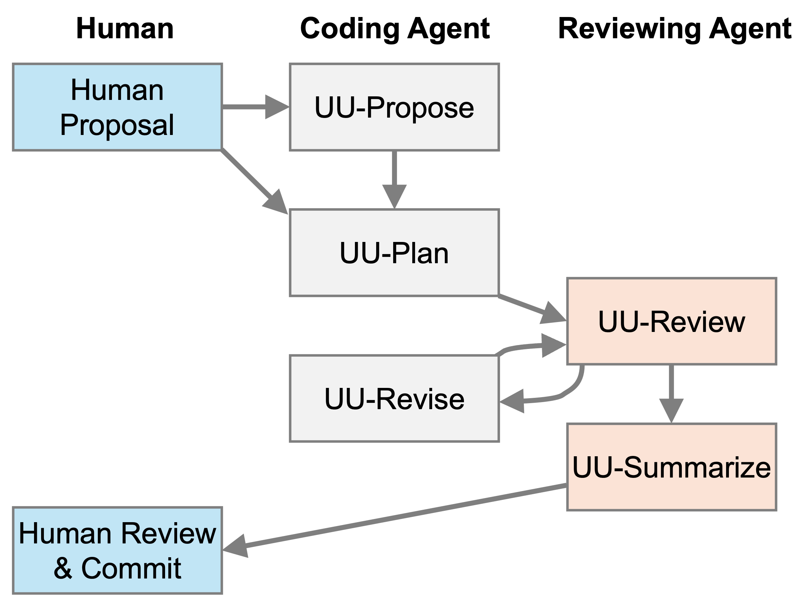

# Iterate *Until Useful*

Until Useful is a portable five-skill workflow for open coding-agent sessions:

1. `uu-propose`: explore a user-supplied direction and recommend one problem to plan
2. `uu-plan`: create an implementation-ready plan from a pasted proposal
3. `uu-review`: review another coding agent's work from its pasted summary
4. `uu-revise`: adjudicate pasted review feedback and implement justified fixes
5. `uu-summarize`: return one concise commit title for the current changeset

## Interactive-session design

These skills are designed for open sessions that already have the repository and conversation context. They do not launch new agents, use non-interactive execution, commit changes, push branches, change the active model, or make approval decisions. They are a manual handoff protocol, not an autonomous workflow: the user selects work, adds context to handoffs, interprets reviews, performs final code review, and commits.

Select the model and reasoning level in the current session. Enter the host's native Plan mode before invoking `uu-plan`. When a host has no Plan mode, the skill uses a read-only fallback and reports that enforcement limitation.

`uu-plan` states a canonical plan path, `docs/uu-<task-slug>.md`. Because Plan modes are often read-only, the worker creates that document from the approved plan as its first implementation action. It carries durable task intent through the loop. `uu-review` reads it but never writes repository files; `uu-revise` reads it but must not modify that plan file, while still being able to update other documentation when the approved work requires it. Pasted worker and reviewer reports carry the evolving implementation and review context.

## Invocation

| Workflow | Claude Code | Codex | Qwen Code |
|---|---|---|---|
| Propose | `/uu-propose notes` | `$uu-propose notes` | `/uu-propose notes` |
| Plan | `/uu-plan proposal` | `$uu-plan proposal` | `/uu-plan proposal` |
| Review | `/uu-review agent summary` | `$uu-review agent summary` | `/uu-review agent summary` |
| Revise | `/uu-revise reviewer report` | `$uu-revise reviewer report` | `/uu-revise reviewer report` |
| Summarize | `/uu-summarize` | `$uu-summarize` | `/uu-summarize` |

Large summaries, reviews, proposals, and notes can be pasted as multiline text after the invocation.

## Install

From the extracted bundle:

```sh
./install.sh --all
```

Install only selected agents:

```sh
./install.sh --claude --codex
./install.sh --qwen
```

Existing `uu-*` skill folders are preserved. Replace them explicitly:

```sh
./install.sh --all --force
```

Complete the rename by removing skill folders from the earlier release:

```sh
./install.sh --all --remove-legacy
```

This removes only the five earlier `project-*` folders from the selected agent skill directories. It does not alter unrelated skills.

Personal installation locations:

- Claude Code: `~/.claude/skills/`
- Codex: `~/.agents/skills/`
- Qwen Code: `~/.qwen/skills/`

The `uu-` prefix keeps the suite fast to invoke and avoids collisions with built-in skills. The skills use portable `name` and `description` frontmatter. Codex also reads each optional `agents/openai.yaml`, which disables implicit invocation there. The shared instructions tell every agent to use these workflows only after manual invocation.

## Codex and Claude Code compatibility

Each `SKILL.md` uses the portable `name` and `description` frontmatter shared by both hosts. It also sets Claude Code's `disable-model-invocation: true` and `user-invocable: true`, so the skills appear as slash commands but cannot be selected implicitly. Codex uses the equivalent setting in each optional `agents/openai.yaml` file: `policy.allow_implicit_invocation: false`. Keep both declarations: Claude Code uses the frontmatter setting, while Codex uses its platform metadata for invocation policy and desktop UI labels.
